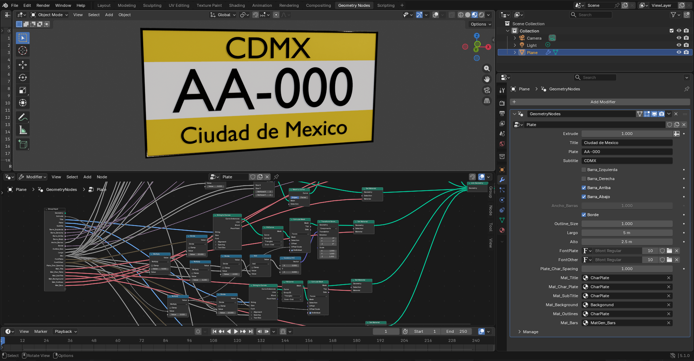
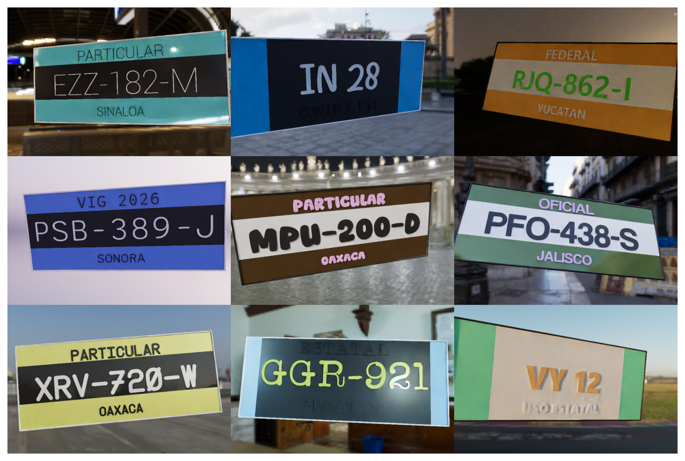

# Basic Procedural License Plate Generator 🚗🔢

A fully procedural and highly customizable license plate generator built inside **Blender** using **Geometry Nodes**. This project is designed to automatically generate infinite variations of realistic license plates, making it an ideal tool for creating synthetic datasets for Machine Learning (like ALPR/ANPR systems) or populating 3D environments.

## 📸 Overview

The core of the generator is driven by a robust Geometry Nodes setup that exposes all major properties directly in the modifier panel.

*The Geometry Nodes node tree and the exposed modifier parameters allowing full control over the plate's dimensions, text, borders, and materials.*

## ✨ Features

Every single render iteration produces a completely unique image by randomizing physical, environmental, and textual properties:

* **100% Procedural Geometry:** Built entirely with Geometry Nodes. Toggle borders, horizontal bars, change dimensions (width/height), and adjust extrusion dynamically.
* **Infinite Text Variations:** Randomizes the main plate pattern (e.g., `AA-000`), the top Title (e.g., state or country), and the bottom Subtitle.
* **Dynamic Typography:** Automatically selects a random font for the text from a designated local `Fonts` directory.
* **Environmental & Lighting Diversity:** With each iteration, the background HDR changes by randomly selecting an HDRI from a local `HDR` folder, ensuring diverse lighting and reflection scenarios.
* **Spatial Randomization:** The rotation and tilt of the license plate change per render to simulate different camera angles and real-world perspectives.
* **Realistic Imperfections:** Renders are executed using the **Cycles engine at exactly 1 step/sample**. This intentionally introduces render noise and artifacts, mimicking low-light camera sensor noise, defects, and real-world grittiness to improve dataset robustness.

## 🖼️ Render Previews

Below is a sample grid showing the diversity of the generated outputs. Notice the different lighting conditions, fonts, regional styles, and physical plate designs.

*Examples of the procedural outputs showing different HDR backgrounds, rotations, text patterns, and plate layouts.*

## 📂 Directory Structure Requirements

To run the automated render variations properly, ensure your project directory contains the following folders:

* `/HDR` - Place your `.hdr` or `.exr` files here. The script will pick a random environment map for each render.
* `/Fonts` - Place your `.ttf` or `.otf` files here. The generator will cycle through these to change the typography of the plates.

## 🚀 How to Use

1. Clone this repository and open the `.blend` file in Blender (version with Geometry Nodes support required).
2. Ensure your `/HDR` and `/Fonts` folders are populated in the same directory as the `.blend` file.
3. Select the `Plate` object to manually tweak base settings in the Geometry Nodes modifier tab.
4. Run the included render script (if applicable) to begin batch-rendering your randomized dataset. Outputs will be generated automatically using Cycles.
